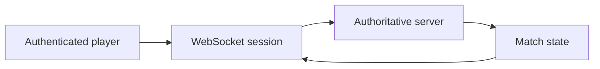

<div align="center">
  <h1>T3A</h1>
  <p><strong>Small server-authoritative multiplayer proof-of-concept for Team Tic-Tac-Toe.</strong></p>
  <p>
    
    
    
    
  </p>
</div>

> **Portfolio status:** Experimental POC. Intentionally small and not production infrastructure.

T3A is a password-protected, server-authoritative multiplayer experiment focused on sessions, realtime state and a deliberately small game loop.



## Render deployment

Use this repository as a Render **Web Service**.

- Runtime: Node
- Branch: `main`
- Build command: `npm run check`
- Start command: `npm start`
- Health check: `/health`
- Instance: Free (demo only)

Required secret environment variable:

- `T3A_ACCESS_PASSWORD` — password shared with invited testers

Recommended secret:

- `T3A_SESSION_SECRET` — Render can generate this automatically when using `render.yaml`

Never commit either secret to Git.

## Local run

```bash
T3A_ACCESS_PASSWORD='change-me' T3A_SESSION_SECRET='local-dev-secret-change-me' npm start
```

Open `http://localhost:8787`.

## Security model

- Access password is verified on the server.
- Successful login creates a signed `HttpOnly` session cookie.
- WebSocket upgrades require a valid authenticated session.
- Login attempts are rate limited in memory.
- Secrets are supplied through environment variables, not frontend JavaScript.

## Scope

This is a private demo/POC, not production infrastructure. Match state is in memory and is lost when the service restarts or a free Render instance spins down.
